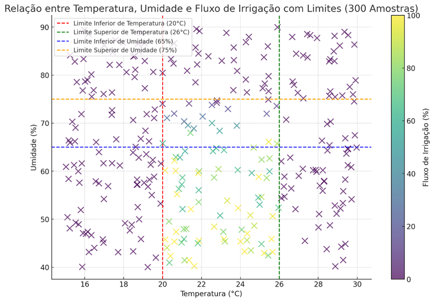
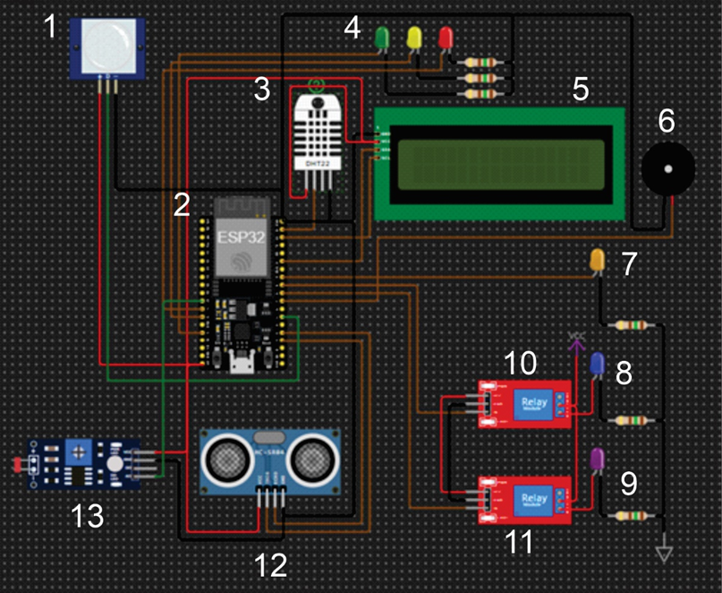
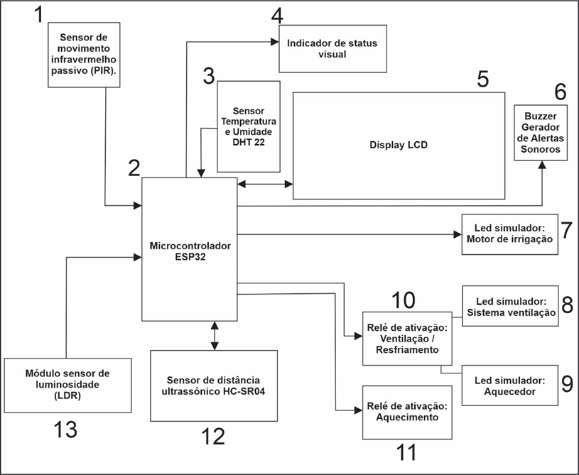
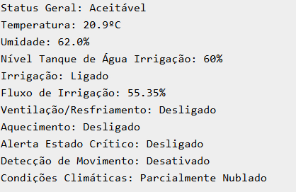
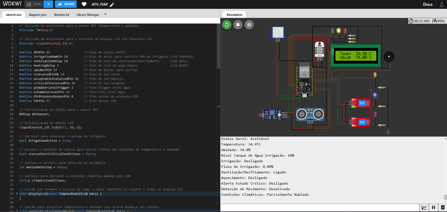

# FIAP - Faculdade de Informática e Administração Paulista
 
 

 

### S.I.M.A - Sistema Inteligente de Monitoramento Agrícola
### 🌱 Para Plantio de Tomates
---
## Grupo 33

## 👨‍🎓 Integrantes: 
- <a href="https://www.linkedin.com/in/a1exlima/">Alex da Silva Lima</a>
- <a href="https://www.linkedin.com/in/johnatanloriano/">Johnatan Sousa Macedo Loriano</a>
- <a href="https://www.linkedin.com/in/matheus-maia-655bb1250/">Matheus Augusto Rodrigues Maia</a>
- <a href="https://www.linkedin.com/in/brunoconter/">Bruno Henrique Nielsen Conter</a>
- <a href="https://www.linkedin.com/in/fabiosantoscardoso/">Fabio Santos Cardoso</a>

## 👩‍🏫 Professores:
### Tutor(a) 
- <a href="https://www.linkedin.com/in/lucas-gomes-moreira-15a8452a/">Lucas Gomes Moreira</a>
### Coordenador(a)
- <a href="https://www.linkedin.com/in/profandregodoi/">André Godoi</a>

## 📜 Descrição

### Introdução
O cultivo de tomates é uma das atividades agrícolas mais importantes devido a sua relevância econômica e nutricional. Seu cultivo bem-sucedido depende de fatores críticos como a temperatura, umidade e luminosidade. Por isso, é essencial aproveitar os recursos de monitoramento e gestão para favorecer o crescimento das plantas e garantir colheitas saudáveis e abundantes. 
Nesse sentido, este projeto apresenta a proposta do Sistema Inteligente de Monitoramento Agrícola SIMA, a ser implementado por meio do microcontrolador ESP32 e um conjunto de sensores que permite a coleta e a análise de dados em tempo real para uma melhor gestão dos recursos agrícolas. Os quatro aspectos principais do sistema incluem o sensor DHT22, que “monitora constantemente a temperatura e umidade do ambiente; o sensor HC-SR04, responsável por controlar o nível de água dos tanques e automatizar o funcionamento da irrigação; o sensor PIR para detectar intrusos no campo; e o sensor LDR, que mede o nível de luz solar para calcular a quantidade de irrigação suficiente para o clima. Isso não só permite monitorar com precisão os parâmetros do cultivo, mas também a automatização sustentável, como a regulação do uso da água. O nível ideal desses fatores, além de assegurado, é mantido automaticamente pelo sistema, o que economiza tempo e recursos para o agricultor e reduz a necessidade de ações manuais frequentes. Por último, a implementação de alarmes sonoros e luminosos também permite reforçar a monitoração e a segurança dos campos, interrompendo rapidamente qualquer irregularidade.
O desenvolvimento deste sistema se apoia em estudos e práticas recomendadas para o cultivo de tomates, que destacam a importância do controle das condições climáticas e o uso responsável da água na agricultura. A utilização de tecnologia, como sensores e microcontroladores, representa uma inovação no setor agrícola, promovendo práticas que não apenas aumentam a produtividade, mas também preservam os recursos naturais.
Este relatório apresenta detalhes sobre a especificação do projeto, funcionalidades e benefícios associados com a implementação do Sistema Inteligente de Monitoramento Agrícola para cultivo de tomate que se deriva para o próximo futuro sustentável no campo agrícola.

## Especificações Para O Plantio Eficiente de Tomates

O cultivo de tomates requer cuidados específicos em relação a temperatura, umidade, irrigação, ventilação e monitoramento contínuo. Descreveremos as práticas recomendadas e as automações implementadas para otimizar o plantio de tomates.

### Condições Ideais para o Cultivo de Tomates

#### Temperatura:
* **Faixa Ideal:** 20°C a 26°C

#### Condições Críticas:
* **Abaixo de 12°C:** prejudicial ao cultivo.
* **Acima de 35°C:** prejudicial ao cultivo.

#### Umidade:
* **Faixa Ideal:** 65% a 75%.

#### Condições Críticas:
* **Abaixo de 60%:** pode afetar o crescimento.
* **Acima de 80%:** pode causar doenças.

#### Luminosidade:
*	**Luminosidade Alta:** Requer mais água devido à evaporação.
*	**Luminosidade Baixa:** A demanda por água pode ser menor.

## Funcionalidades do Sistema

*	**Sensor Temperatura e Umidade:** Monitora temperatura e umidade do ambiente.

*	**Display Visual:** Exibe os dados de temperatura e umidade em um display LCD.

*	**Irrigação Automática com Controle de Luminosidade:** O sistema de irrigação automática controla o fluxo de água com base na umidade e no nível de água, utilizando PWM para o motor de irrigação. Além disso, ajusta o fluxo de irrigação de acordo com a luminosidade medida por um sensor LDR. Se o nível de água estiver baixo, o sistema emite um alerta sonoro para notificar sobre a condição crítica.

*	**Ventilação e Resfriamento:** Ativa o sistema de ventilação se a umidade exceder 75% ou a temperatura ultrapassar 26°C. Desativar quando a temperatura estiver abaixo de 26ºC.

*	**Aquecimento:** Ativa o sistema de aquecimento se a temperatura estiver abaixo de 20°C.

*	**Alertas Críticos:** Gera alertas sonoros se a temperatura estiver fora da faixa segura (12-35°C) ou a umidade fora do intervalo (60-80%).

*	**Indicador de Status Visual:** Controla LEDs para indicar o status geral (Crítico, aceitável ou OK) com base nas condições de temperatura, umidade e atividade de irrigação.

*	**Detecção de Movimento:** Monitora a presença de animais ou pessoas com um sensor PIR. Alertando as presenças através alertas sonoros.

*	**Nível de Água:** Monitora o nível de água utilizando sensores de nível, no caso o sensor de distância ultrassônico HC-SR04. Nível de água abaixo de 20%, alerta sonoro é emitido.

## Detalhamento das Funcionalidades Principais

## 1. Funcionalidade: Irrigação Automática com Controle de Luminosidade

### Objetivo da Solução

O objetivo principal é gerenciar a irrigação de maneira automática para o cultivo de tomates, ajustando o fluxo de água com base nas condições do ambiente, como temperatura, umidade, nível de água e luminosidade. Essa abordagem visa maximizar a eficiência do uso da água e garantir que as plantas de tomate recebam a hidratação adequada, fundamental para seu desenvolvimento saudável e a produção de frutos de qualidade.

### Condições de Operação

*	**Nível de Água:** O sistema monitora constantemente o nível de água disponível no reservatório. Se o nível de água cair abaixo de um determinado nível no caso (20%), a irrigação é desativada. Essa medida não apenas preserva o recurso hídrico, mas também evita danos ao sistema de irrigação devido à falta de água, o que é crucial para a saúde das plantas de tomate. Em caso de baixo nível, um alerta sonoro é emitido para avisar sobre a situação.

*	**Ativação da Irrigação:** Quando o nível de água atinge um nível seguro (acima de 50%), a irrigação é reativada. Esse controle é crucial para evitar desperdícios e garantir que a água esteja sendo utilizada apenas quando há um suprimento suficiente, assegurando que as plantas de tomate recebam a umidade necessária para um crescimento ideal.

### Ajustes com Base nas Condições Ambientais

**Temperatura e Umidade:** O sistema avalia as condições climáticas locais. Se a temperatura estiver muito baixa (abaixo de 20°C) ou muito alta (acima de 26°C), ou se a umidade do ar estiver excessiva (acima de 75%), a irrigação é desativada. Essas medidas garantem que a irrigação não ocorra em condições inadequadas, que poderiam ser prejudiciais ao cultivo de tomates ou resultar em desperdício de água.

### Relação entre temperatura, umidade e o fluxo de irrigação

Figura 1: Gráfico representativo demostrando a relação entre temperatura, umidade e o fluxo de irrigação

O gráfico permite visualizar como o fluxo de irrigação é afetado pelas condições de temperatura e umidade. Notavelmente, a irrigação tende a ser desativada quando a temperatura está fora dos limites estabelecidos ou quando a umidade está acima de 75%. A variação do fluxo de irrigação em resposta a diferentes níveis de umidade é claramente demonstrada, revelando que, em condições de umidade mais baixa, a irrigação é mais intensa, enquanto, em umidade mais alta, o fluxo é reduzido.

### Integração da Luminosidade

**Sensor de Luminosidade:** O sistema utiliza um sensor para medir a luminosidade do ambiente. Com base na quantidade de luz disponível, o fluxo de água pode ser ajustado ainda mais. Em dias nublados, quando a luz é limitada, o sistema pode aumentar o fluxo de água para compensar a falta de fotossíntese, crucial para o crescimento saudável das plantas de tomate. Por outro lado, em dias ensolarados, o fluxo pode ser reduzido para evitar excesso de irrigação, que poderia causar estresse hídrico nas plantas.

### Resultado e Benefícios

Essa lógica de controle não só melhora a eficiência do uso da água, mas também contribui para a saúde das plantas de tomate. O sistema atua de maneira autônoma, reduzindo a necessidade de intervenção manual e permitindo que a irrigação ocorra de forma otimizada, conforme as necessidades reais das plantas. Em última análise, essa solução proporciona uma irrigação mais inteligente, sustentável e econômica, beneficiando tanto os agricultores quanto o meio ambiente, ao mesmo tempo que garante a produção de tomates de alta qualidade.

## 2. Funcionalidade: Controle de Ventilação e Resfriamento

### Objetivo da Solução

A funcionalidade de controle de ventilação e resfriamento é crucial para otimizar as condições climáticas em estufas e áreas de cultivo de tomates, garantindo que a temperatura e a umidade se mantenham dentro de níveis ideais para o desenvolvimento saudável das plantas. Esse sistema é especialmente importante devido à sensibilidade do tomateiro a variações climáticas, que podem impactar diretamente a qualidade e a produtividade da colheita.

### Condições de Ativação da Ventilação

**Avaliação das Condições Ambientais:** A primeira etapa envolve o monitoramento contínuo da temperatura e da umidade do ar. Esses dados são fundamentais para determinar se as condições estão favoráveis para o cultivo de tomates, que geralmente prosperam em ambientes com temperaturas entre 20°C e 25°C e umidade relativa em torno de 60% a 75%.

### Ativação da Ventilação:

*	**Alta Umidade**: Se a umidade do ar exceder 75%, o sistema ativa a ventilação. Isso é especialmente crucial no cultivo de tomates, pois a umidade excessiva pode favorecer o surgimento de doenças fúngicas, como o míldio, que pode comprometer a saúde das plantas. A ventilação ajuda a reduzir a umidade, promovendo um ambiente mais saudável e minimizando o risco de doenças.

*	**Temperatura Elevada:** Se a temperatura ambiente ultrapassar 26°C, a ventilação também é ativada. Temperaturas elevadas podem causar estresse térmico nos tomateiros, prejudicando seu crescimento e a produção de frutos. O resfriamento por ventilação é essencial para manter a temperatura em níveis ideais, permitindo que as plantas se desenvolvam adequadamente e produzam frutos de qualidade.

### Condições de Desativação da Ventilação

### Desativação da Ventilação:

*	**Umidade Controlada:** Se a umidade estiver entre 65% e 75% e a temperatura for inferior a 26°C, o sistema desativa a ventilação. Essa medida é importante para evitar que o ambiente se torne excessivamente seco, o que também pode ser prejudicial para os tomateiros, pois a falta de umidade pode afetar a frutificação.

*	**Ambiente Favorável:** Se a temperatura estiver abaixo de 26°C e a umidade estiver dentro de limites normais (abaixo de 65%), a ventilação é desativada. Manter um ambiente equilibrado é fundamental para o cultivo de tomates, e o sistema ajusta automaticamente a ventilação conforme as condições mudam.

### Resultados e Benefícios

Esse sistema de controle de ventilação e resfriamento opera de maneira autônoma, reduzindo a necessidade de monitoramento humano constante. Ao ajustar automaticamente a ventilação com base em dados ambientais, ele promove um ambiente de cultivo mais saudável para os tomateiros, resultando em:

**Saúde das Plantas:** A manutenção de condições ideais de temperatura e umidade minimiza o risco de doenças, promovendo o crescimento saudável das plantas de tomate.

**Eficiência Energética:** O controle dinâmico da ventilação contribui para a eficiência energética, pois a ventilação é ativada somente quando necessário, evitando o uso excessivo de energia.

**Aumento da Produtividade:** Com condições ambientais otimizadas, os tomateiros podem alcançar seu potencial máximo de crescimento e produção, resultando em colheitas mais abundantes e de melhor qualidade.

## 3. Funcionalidade: Controle de Aquecimento

A funcionalidade de controle de aquecimento é fundamental para otimizar as condições climáticas em estufas e outras áreas de cultivo de tomates. Esse sistema assegura que a temperatura se mantenha em níveis ideais, contribuindo para o desenvolvimento saudável das plantas e, consequentemente, para a produtividade agrícola. O cultivo de tomates é particularmente sensível a temperaturas extremas, e a implementação de um controle eficaz de aquecimento pode fazer uma diferença significativa na qualidade e na quantidade da colheita.

### Condições de Ativação do Aquecimento

**Avaliação da Temperatura:** O controle de aquecimento inicia-se com a monitorização contínua da temperatura do ambiente de cultivo. Essa análise é essencial, uma vez que os tomates se desenvolvem melhor em temperaturas que variam entre 20°C e 25°C. Temperaturas abaixo de 20°C podem prejudicar o crescimento das plantas, afetando sua saúde e desenvolvimento.

### Ativação do Aquecimento:

**Temperaturas Baixas:** Se a temperatura do ambiente cair abaixo de 20°C, o sistema ativa o aquecimento. Este ajuste é crucial para evitar que as plantas sofram com o frio, que pode levar ao estresse térmico e comprometer o processo de fotossíntese, resultando em uma produção de frutos inferior. O aquecimento cria um ambiente mais acolhedor para os tomates, estimulando o crescimento e a frutificação.

### Condições de Desativação do Aquecimento

### Desativação do Aquecimento:

**Temperaturas Adequadas:** Quando a temperatura do ambiente atinge ou supera os 20°C, o sistema desativa automaticamente o aquecimento. Essa funcionalidade é importante para evitar o superaquecimento, que pode ser igualmente prejudicial às plantas. O controle preciso da temperatura assegura que o ambiente se mantenha dentro da faixa ideal para o cultivo de tomates, favorecendo seu desenvolvimento.

### Resultados e Benefícios

A implementação do sistema de controle de aquecimento proporciona uma série de vantagens significativas para o cultivo de tomates:

**Manutenção da Temperatura Ideal:** O aquecimento automático garante que as plantas estejam sempre em condições climáticas adequadas, minimizando o risco de danos causados por temperaturas frias.

**Promoção do Crescimento Saudável:** Ao evitar temperaturas inadequadas, o sistema contribui para o crescimento robusto das plantas e uma frutificação saudável, resultando em uma colheita mais abundante.

**Eficiência Energética:** O controle automatizado do aquecimento também promove eficiência energética, já que o sistema ativa o aquecimento apenas quando necessário, evitando desperdícios de energia.

**Redução da Intervenção Humana:** Com um sistema de aquecimento que opera de forma autônoma, os agricultores podem reduzir a necessidade de monitoramento constante, permitindo um gerenciamento mais eficaz do cultivo.

## 4. Funcionalidade: Geração de Alertas Sonoros em Condições Críticas

A funcionalidade de geração de alertas sonoros é uma medida importante para a gestão proativa das condições climáticas em ambientes de cultivo de tomates. Este sistema desempenha um papel crucial na detecção de condições que possam comprometer a saúde e o desenvolvimento das plantas, permitindo que os agricultores tomem decisões rápidas para mitigar riscos.

### Condições Críticas a Serem Monitoradas

**Monitoramento da Temperatura:** O sistema monitora continuamente a temperatura do ambiente de cultivo. As temperaturas ideais para o crescimento de tomates variam entre 20°C e 25°C. Temperaturas abaixo de 12°C podem levar ao estresse térmico e afetar negativamente o desenvolvimento das plantas, enquanto temperaturas acima de 35°C podem resultar em queimaduras nas folhas e comprometimento da frutificação.

**Monitoramento da Umidade:** Além da temperatura, a umidade também é um fator crítico. Para o cultivo de tomates, um nível de umidade abaixo de 60% ou acima de 80% pode ser prejudicial. A umidade muito baixa pode levar à desidratação das plantas, enquanto a umidade excessiva pode criar um ambiente propício para o desenvolvimento de doenças, como fungos.

### Geração de Alertas Sonoros

**Identificação de Condições Críticas:** O sistema gera um alerta sonoro sempre que as condições monitoradas (temperatura ou umidade) ultrapassam os limites considerados seguros. Essa ação é essencial para alertar os agricultores sobre situações que requerem intervenção imediata, como a necessidade de aquecimento, resfriamento ou ajuste na irrigação.

**Execução do Alerta Sonoro:** Quando o sistema detecta uma condição crítica, um sinal sonoro polifônico é emitido através do componente buzzer. O alerta é composto por dois toques curtos, que servem como um aviso claro e perceptível. Essa abordagem garante que o agricultor esteja ciente da situação, mesmo em ambientes de cultivo onde o ruído pode mascarar outros sinais.

### Resultados e Benefícios

A implementação de um sistema de alertas sonoros para condições críticas proporciona vários benefícios no cultivo de tomates:

**Resposta Rápida a Situações Críticas:** Os alertas sonoros permitem que os agricultores respondam rapidamente a condições adversas, minimizando os riscos associados a temperaturas extremas ou níveis inadequados de umidade. Essa ação preventiva é essencial para preservar a saúde das plantas.

**Proteção das Culturas:** Ao fornecer um aviso oportuno, o sistema ajuda a evitar danos que poderiam resultar em perdas significativas de produtividade. A capacidade de agir rapidamente pode fazer a diferença entre uma colheita bem-sucedida e uma colheita comprometida.

**Facilidade de Monitoramento:** A geração de alertas sonoros reduz a necessidade de monitoramento constante e manual das condições climáticas, permitindo que os agricultores se concentrem em outras tarefas, sabendo que serão alertados em caso de anomalias.

**Aumento da Sustentabilidade:** A adoção de tecnologias que promovem a vigilância ativa das condições de cultivo contribui para práticas agrícolas mais sustentáveis, minimizando o uso de recursos e otimizando o cuidado com as plantas.

## 5. Funcionalidade: Indicador de Status Visual

A funcionalidade Indicador de Status Visual é fundamental para garantir a saúde e a produtividade das plantas de tomate em ambientes controlados, como estufas. Essa função monitora constantemente as condições climáticas e fornece um status geral que permite a tomada de decisões rápidas sobre o manejo das culturas.

### Monitoramento Contínuo

**Coleta de Dados Ambientais:** O sistema começa coletando dados sobre a temperatura e a umidade do ar. Esses parâmetros são essenciais, pois influenciam diretamente o crescimento e desenvolvimento das plantas de tomate. As condições ideais para o cultivo de tomates incluem temperaturas entre 20°C e 26°C e umidade relativa entre 65% e 75%.

**Análise do Status Geral:** Com base nos dados coletados, o sistema avalia as condições e determina um status geral, que pode ser "Crítico", "OK" ou "Aceitável". Essa avaliação é baseada em um conjunto de critérios predeterminados, que levam em conta tanto a temperatura quanto a umidade.

### Definição de Status

**Status "Crítico":** Se o sistema identificar que as condições estão fora dos limites seguros, por exemplo, temperaturas abaixo de 12°C ou acima de 35°C, ou umidade fora da faixa de 60% a 80%, o status é definido como "Crítico". Nessa situação, é essencial que os agricultores tomem medidas imediatas para corrigir as condições adversas. O alerta visual é dado através de um LED vermelho aceso, indicando que a intervenção é necessária.

**Status "OK":** Quando a temperatura e a umidade estão dentro dos limites ideais e a irrigação está ativa, o sistema indica que as condições são "OK". Nesse estado, um LED verde é aceso, sinalizando um ambiente saudável para as plantas. Essa condição é ideal para o crescimento dos tomates, permitindo que as plantas se desenvolvam de maneira adequada.

**Status "Aceitável":** O status "Aceitável" é ativado quando as condições ambientais estão fora da faixa ideal, mas ainda são toleráveis. Por exemplo, temperaturas entre 12°C e 20°C ou entre 26°C e 35°C, ou umidade entre 60% e 65% ou entre 75% e 80%. Nessa situação, um LED amarelo é aceso, indicando que, embora as condições não sejam ideais, elas ainda não requerem ação imediata, mas sim monitoramento atento.

**Situações Não Classificadas:** Se as condições não se enquadrarem em nenhuma das categorias anteriores, o sistema retornará ao status "Crítico". Isso garante que, mesmo em situações não claramente definidas, o alerta vermelho será acionado, sinalizando a necessidade de intervenção.

### Resultados e Benefícios

A implementação dessa funcionalidade de análise de temperatura e umidade oferece diversos benefícios para o cultivo de tomates:

**Gestão Proativa das Condições:** A capacidade de monitorar continuamente e classificar o status das condições ambientais permite que os agricultores adotem uma abordagem proativa em relação ao manejo das plantas, minimizando riscos.

**Melhora na Saúde das Plantas:** Ao identificar rapidamente condições críticas, é possível evitar estresses que poderiam comprometer a saúde das plantas e a qualidade da colheita.

**Eficiência na Irrigação e Outros Recursos:** O sistema assegura que a irrigação seja mantida quando as condições são adequadas, otimizando o uso da água e reduzindo desperdícios.

**Aumento da Produtividade:** Com um ambiente monitorado e ajustado continuamente, as plantas de tomate têm maior chance de atingir seu potencial máximo de crescimento e produtividade.

## 6. Funcionalidade: Detecção de Movimento

A funcionalidade de detecção de movimento é crucial para garantir a segurança e proteção das plantações de tomates, especialmente em ambientes onde podem ocorrer ameaças de animais ou intrusos humanos. Essa funcionalidade utiliza o sensor PIR para identificar a presença de movimento e aciona um sistema de alerta sonoro quando necessário.

### Lógica da Detecção de Movimento

**Monitoramento do Ambiente:** O sistema inicia o processo de detecção do movimento, que inclui o sensor PIR. Esse dispositivo monitora constantemente a área da plantação, analisando qualquer alteração que possa indicar a presença de pessoas ou animais.

**Condição de Ativação:** Assim que o sensor detecta movimento, ele envia um sinal ao sistema indicando que uma atividade foi registrada. Esse sinal é classificado como positivo o que significa que o movimento foi efetivamente detectado.

**Emissão de Alerta Sonoro:** Quando o movimento é detectado, o sistema aciona um alerta sonoro. Este alerta é emitido na forma de uma sirene, que é projetada para ser audível em uma ampla área ao redor da plantação. A emissão do som ocorre em um padrão de frequência que varia progressivamente, começando em 200 Hz, aumentando até 600 Hz e depois retornando a 200 Hz. Este tipo de sinal sonoro é eficaz para chamar a atenção de pessoas que possam estar nas proximidades, além de ser um meio de dissuadir intrusos ou animais.

**Ciclo de Alerta:** O alerta sonoro é emitido em um ciclo repetido, onde o som é produzido várias vezes. Essa repetição serve para aumentar a probabilidade de que o alerta seja percebido, garantindo que a presença de movimento não passe despercebida.

**Desativação do Alerta:** Se não houver mais movimento detectado, o sistema automaticamente desativa o alerta sonoro. Isso garante que o sistema não permaneça emitindo sons desnecessários, evitando assim a poluição sonora no ambiente e permitindo que os trabalhadores da plantação possam realizar suas atividades sem interrupções.

### Resultados e Benefícios

A implementação dessa funcionalidade de detecção de movimento oferece vários benefícios importantes para a segurança das plantações de tomates:

**Segurança da Plantação:** O sistema ajuda a proteger a plantação de intrusões, seja por pessoas não autorizadas ou por animais que possam causar danos às plantas. Isso é especialmente importante em áreas rurais onde a segurança pode ser uma preocupação.

**Resposta Rápida a Ameaças:** Ao emitir um alerta sonoro imediato, o sistema permite que os agricultores e trabalhadores possam reagir rapidamente a potenciais ameaças, minimizando os danos à plantação.

**Monitoramento Contínuo:** A detecção de movimento proporciona uma vigilância constante sobre a plantação, reduzindo a necessidade de patrulhas humanas regulares e permitindo que os agricultores se concentrem em outras tarefas.

**Prevenção de Perdas:** Com a capacidade de identificar e reagir a movimentos indesejados, a funcionalidade contribui para a prevenção de perdas financeiras associadas a danos causados por animais ou por ações de vandalismo.

## Circuito Eletrônico e sua correspondência em funcionalidade aos sensores

Figura 2: Circuito eletrônico desenvolvido no simulador Wokwi para testar as funcionalidades do projeto

 
 

Figura 3: Fluxograma representativo do circuito eletrônico para identificação dos componentes e suas funcionalidades. Setas indicam a direção do sinal em relação o microcontrolador.

## Resumo do funcionamento baseado nos componentes

**1. Sensores e Componentes Utilizados:**

*	**DHT22:** Monitora a temperatura e umidade do ar.
*	**HC-SR04:** Mede o nível de água no tanque de irrigação usando ultrassom.
*	**LDR:** Detecta a luminosidade ambiente para ajustar a irrigação.
*	**PIR:** Detecta movimento de pessoas ou animais na área de plantio.
*	**Relés e PWM:** Controlam sistemas de irrigação, ventilação, resfriamento e aquecimento.
*	**Display LCD:** Exibe informações de temperatura e umidade.
*	**LEDs de Status:** Indicam o estado geral das condições ambientais.
*	**Buzzer:** Emite alertas sonoros em condições críticas.

**2. Funcionalidades Principais:**

*	**Monitoramento Contínuo:** O sistema monitora constantemente a temperatura, umidade, nível de água e luminosidade.
*	**Irrigação Automática:** Controla o fluxo de água com base na umidade, temperatura e luminosidade. Se o nível de água estiver baixo, a irrigação é desativada e um alerta sonoro é emitido.
*	**Controle de Ventilação e Resfriamento:** Ativa a ventilação se a temperatura ou umidade exceder limites seguros.
*	**Controle de Aquecimento:** Ativa o aquecimento se a temperatura cair abaixo de 20ºC.
*	**Alertas Sonoros:** Emite alertas sonoros quando as condições de temperatura ou umidade são críticas.
*	**Detecção de Movimento:** Detecta movimento e emite um alerta sonoro para segurança.

**3. Interface e Feedback:**

*	**Display LCD:** Mostra dados de temperatura e umidade.
*	LEDs de Status: Indicam se as condições são críticas, aceitáveis ou ideais.
*	**Serial Monitor:** Imprime logs detalhados para monitoramento e diagnóstico.

 

Figura 4: Tela do serial monitor exibindo o log de monitoramento

 
 

**4. Automatização e Sustentabilidade:**
*	O sistema opera de forma autônoma, reduzindo a necessidade de intervenção manual e otimizando o uso de recursos como água e energia.
*	Promove práticas agrícolas sustentáveis, aumentando a produtividade e garantindo colheitas de alta qualidade.

## Simulação do projeto

A simulação do projeto na plataforma [Wokwi](https://wokwi.com/projects/412397881610314753) possibilitou o desenvolvimento, teste e ajuste do código e da configuração de hardware em um ambiente virtual, otimizando tempo e recursos antes da construção do protótipo físico.

Figura 5: Tela de simulação na plataforma wokwi

### Diagrama e código no simulador Wokwi
O diagrama completo do circuito eletrônico e código em C++ pode ser acessado no Wokwi por meio do [link do projeto](https://wokwi.com/projects/412397881610314753).

## Conclusão:

O Sistema Inteligente de Monitoramento Agrícola (S.I.M.A) para o **cultivo de tomates** representa um avanço significativo na automação e sustentabilidade da agricultura moderna. Com o uso de sensores de temperatura, umidade, luminosidade e detecção de intrusos, o SIMA oferece um monitoramento completo e em tempo real das condições essenciais ao cultivo de tomates, possibilitando uma gestão eficiente e adaptável. A automação dos processos de irrigação, ventilação e aquecimento não só garante que as plantas estejam constantemente em condições ideais, mas também reduz a necessidade de intervenção manual e otimiza o uso de recursos naturais, como a água e a energia.
O impacto positivo do SIMA se reflete em colheitas mais produtivas e saudáveis, contribuindo para a economia de recursos e promovendo práticas agrícolas mais sustentáveis. O sistema não apenas facilita a vida dos agricultores, mas também ajuda a preservar o meio ambiente, mostrando-se como uma ferramenta fundamental para o futuro da agricultura inteligente. Em suma, o SIMA integra tecnologia e agricultura de maneira inovadora, promovendo colheitas mais abundantes e de qualidade superior, alinhadas às demandas de um futuro sustentável.

## Referências para o desenvolvimento do projeto:

*	https://www.decorfacil.com/como-plantar-tomate/
*	https://www.advancingalternatives.com/blog/controlling-humidity-in-tomato-production/
*	https://canaldohorticultor.com.br/informacoes-tecnicas-para-cultivar-tomates/
*	https://www.bhg.com/gardening/vegetable/vegetables/how-to-plant-and-grow-tomatoes/
*	https://www.tomatonews.com/en/how-are-sensors-revolutionizing-tomato-farming-practices_2_2404.html
