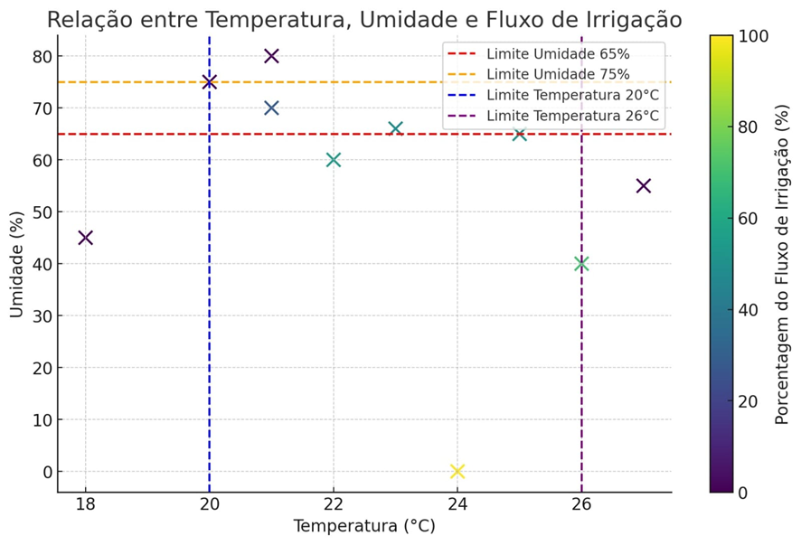

# Tabela de Testes Controle de Irrigação

| Teste | Temperatura (°C) | Umidade (%) | Fluxo de Irrigação Esperado (%) | Fluxo de Irrigação Medido (%) | Condição Avaliada |
|-------|------------------|-------------|---------------------------------|-------------------------------|-------------------|
| 1     | 18               | 45          | 0                               | 0                             | Temperatura baixa, fluxo 0% |
| 2     | 24               | 0           | 100                             | 100                           | Temperatura ideal, umidade 0%, fluxo máximo |
| 3     | 22               | 60          | 54                              | 54                            | Temperatura ideal, umidade moderada, fluxo proporcional (50%-100%) |
| 4     | 25               | 65          | 50                              | 50                            | Temperatura ideal, umidade no limite inferior, fluxo mínimo (50%) |
| 5     | 23               | 66          | <50                             | 49                            | Temperatura ideal, umidade ligeiramente acima de 65%, fluxo <50% |
| 6     | 21               | 70          | 28                              | 28                            | Temperatura ideal, umidade na faixa de 66%-75%, fluxo proporcional (0% - <50%) |
| 7     | 20               | 75          | 0                               | 0                             | Umidade no limite superior, fluxo 0% |
| 8     | 26               | 40          | 70                              | 70                            | Temperatura no limite superior, umidade baixa, fluxo máximo |
| 9     | 27               | 55          | 0                               | 0                             | Temperatura alta (>26°C), fluxo 0% |
| 10    | 21               | 80          | 0                               | 0                             | Umidade alta (>75%), fluxo 0% |

